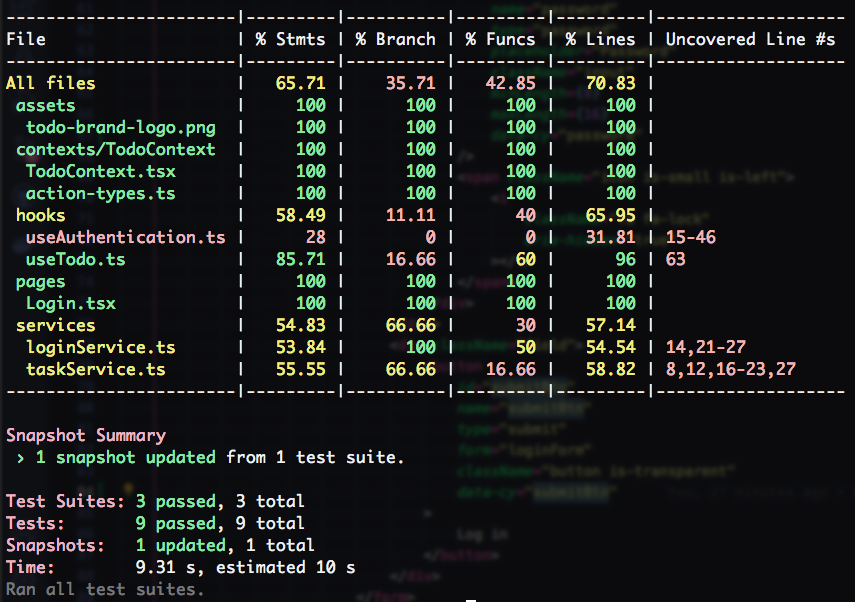

# My TODO Application

It's just a proof of concept.

> :bulb: Feel free to add any improvement/sugesstion you consider.

### Comments

This is a conceptual test using the following technologies:

- [React](https://react.dev/).
- [TypeScript](https://www.typescriptlang.org/).
- [Vite](https://vitejs.dev/).
- [Bulma](https://bulma.io/).

### 🎯 Goals

##### Authorization

- Simple `/login` page to perform a submit operation, a fake **authorization**, and finally we set a **cookie**.
- Redirects to `/home` and **persist the session** even if we close the browser's tab/app.

##### TODO app

Basic TODO app that allows you to: *Add*, *Edit*, *List*, and *Delete* tasks.

###### About the tasks:

- Whenever we close the browser's tab/app, **the tasks should persist**.
- Task should be **removed as soon as we sign out of the app**.

> Tasks are being persisted in `LocalStorage`.


### Installation and running the project

The project requires [Node.js](https://nodejs.org/).

Clone the repository:

```shell
git clone https://github.com/christianjtr/todo-app.git
```
### Demo


### Compiles and hot-reloads for development

```
npm run dev
```

### Compiles and minifies for production

```
npm run build
```

### Linting and fixes

Here, we are using [ESLint](https://eslint.org/).

```
npm run lint
```

### Run tests

Tools used for testing:

- [React Testing Library](https://testing-library.com/).
- [Cypress](https://www.cypress.io/).

```
npm run test
npm run cy:e2e
```

##### Coverage report example

Samples:
- Testing a custom react hook.
- A faked API service call.
- Mounting and rendering a component. `<Login />`.



:memo: In case you need to update a `snapshot`, run this command:

```
npm run test -- -u
```

##### Cypress test sample

Samples:

- Visit `/login` page.
- Perform a **submit** operation:
  - Visiting page.
  - Filling in login form.
  - Setting the cookie.
  - Check URL change.
 


### Technologies

React, TypeScript, Bulma, Vite, React Testing Library, Cypress.